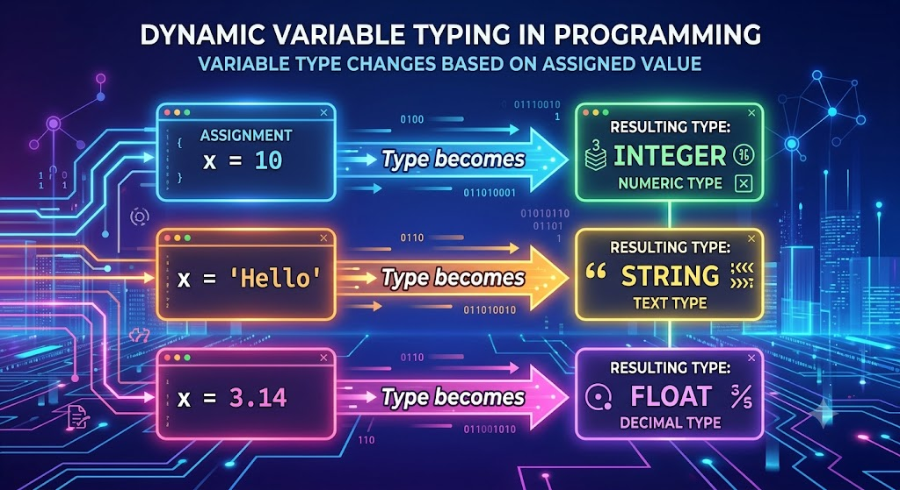
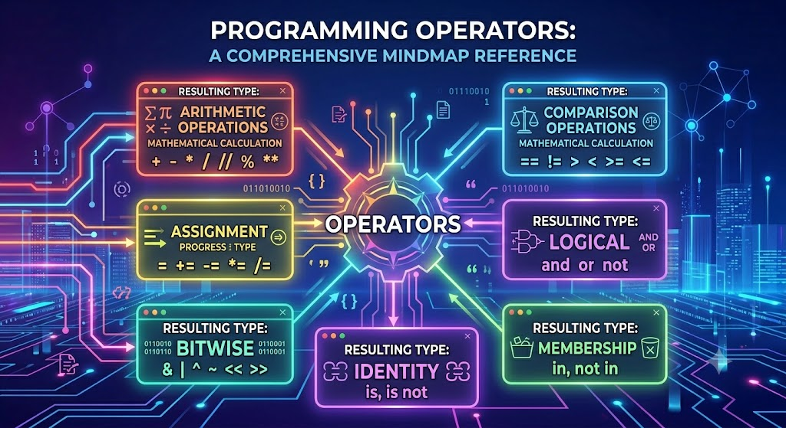
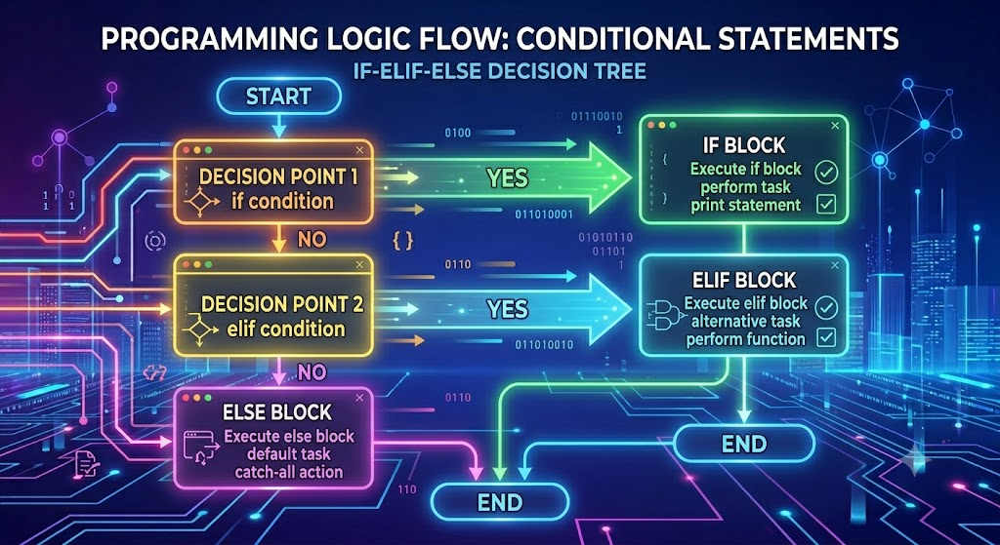

# 🚀 Day 2: Python Data Types, Operators, and Decision Control Statements

Welcome to Day 2! Today we dive deep into Python's foundational elements. This agenda covers Data Types, Operators, and Conditional Statements as prepared by the instructor.

## 🤯 1. Python Data Types

### Introduction

Python supports dynamic typing, meaning you don't need to explicitly declare the type of a variable.

### Categorization

- **Text Data Type**: `str` (String)
- **Boolean Data Type**: `bool` (`True` or `False`)
- **Sequence Data Types**: `list` (mutable array), `tuple` (immutable array), `range`
- **Set Data Types**: `set` (unique items), `frozenset` (immutable set)
- **Mapping Data Type**: `dict` (Key-Value pairs)

### None Data Type

| Property          | None (`NoneType`)                                       |
| ----------------- | ------------------------------------------------------- |
| Meaning           | Represents **No Value / Null Value**                    |
| Data Type         | `NoneType`                                              |
| Value             | `None`                                                  |
| Mutable           | ❌ No                                                   |
| Singleton         | ✅ Yes (Only one `None` object exists)                  |
| Boolean Value     | `False`                                                 |
| Best Way to Check | `x is None`                                             |
| Common Use        | Missing, Unknown, or Uninitialized Data                 |
| Example           | `salary = None`                                         |
| Function Return   | Returned automatically if no `return` statement is used |

### Exploring Data Types

Useful functions to inspect variables:

- `type()`: Get data type
- `id()`: Get memory address
- `dir()`: List attributes and methods
- `help()`: Get documentation
- `__doc__`: Access docstring

---

## 🛠️ 2. Python Operators

### Introduction to Operators

Operators are special symbols that perform operations on operands (variables and values).

### Identity vs Equality (`is` vs `==`)

| Feature           | `==` (Equality Operator)             | `is` (Identity Operator)                        |
| ----------------- | ------------------------------------ | ----------------------------------------------- |
| **Purpose**       | Compares **values**                  | Compares **object identity (memory address)**   |
| **Checks**        | Whether the data/content is the same | Whether both variables refer to the same object |
| **Example True**  | `[1, 2] == [1, 2]`                   | `a = b` then `a is b`                           |
| **Example False** | `10 == 20`                           | `[1, 2] is [1, 2]`                              |

### Precedence and Associativity Table

| Precedence  | Operators                                                        | Description                                  | Associativity |
| ----------- | ---------------------------------------------------------------- | -------------------------------------------- | ------------- |
| 1 (Highest) | `()`                                                             | Parentheses                                  | Left → Right  |
| 2           | `**`                                                             | Exponentiation                               | Right → Left  |
| 3           | `+x`, `-x`, `~x`                                                 | Unary Plus, Minus, Bitwise NOT               | Right → Left  |
| 4           | `*`, `/`, `//`, `%`                                              | Multiplication, Division, Floor Div, Modulus | Left → Right  |
| 5           | `+`, `-`                                                         | Addition, Subtraction                        | Left → Right  |
| 6           | `<<`, `>>`                                                       | Bitwise Shift                                | Left → Right  |
| 7           | `&`                                                              | Bitwise AND                                  | Left → Right  |
| 8           | `^`                                                              | Bitwise XOR                                  | Left → Right  |
| 9           | `\|`                                                             | Bitwise OR                                   | Left → Right  |
| 10          | `==`, `!=`, `>`, `<`, `>=`, `<=`, `is`, `is not`, `in`, `not in` | Comparison, Identity, Membership             | Left → Right  |
| 11          | `not`                                                            | Logical NOT                                  | Right → Left  |
| 12          | `and`                                                            | Logical AND                                  | Left → Right  |
| 13          | `or`                                                             | Logical OR                                   | Left → Right  |
| 14 (Lowest) | `=`, `+=`, `-=`, `*=`, `/=`, `//=`, `%=`, `**=`                  | Assignment Operators                         | Right → Left  |

---

## 🔀 3. Conditional Statements (Decision Control)

Topics covered:

1. **`if` Statement**: Check positive numbers, voting eligibility.
2. **`if-else` Statement**: Even/Odd, Pass/Fail.
3. **`if-elif-else` Statement**: Grade system, Menu programs.
4. **Nested Conditionals**: `if` inside `if`.
5. **Conditional Expression (Ternary Operator)**: `result = "Pass" if marks >= 40 else "Fail"`
6. **Match Case**: The new modern switch-case implementation in Python.

---

## 💻 4. Practice Questions & Project

We have several practical questions focusing on:

- Creating Data Types and printing memory IDs and Types.
- Predicting output based on Operator Precedence.
- Predicting logical and bitwise operator outputs.
- Building Menu Programs using `if-elif-else` and `match`.

### 🚀 Day-02 Project: University Management System

A mini project to tie it all together:

- Inputs Student Name and Roll Number.
- Offers a Menu (Result Calculator, Attendance Checker, Scholarship Checker).
- Result Calculator accepts marks, computes percentage and grade, and outputs a properly formatted Result Card.

## 📓 Tutorial Notebook

All the practice questions and the University Management System project have been setup in today's notebook for you to solve!

- 📓 [Day 2 Tutorial Notebook](./NoteBook/02_Notebook.ipynb)

Maje karo aur Happy Coding! 😎🔥
