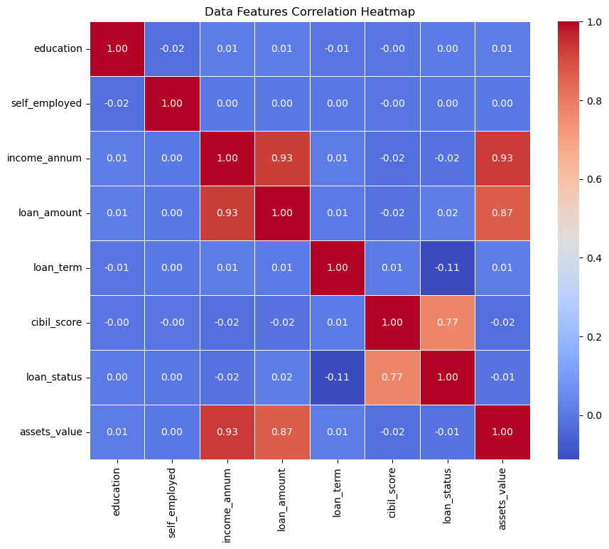
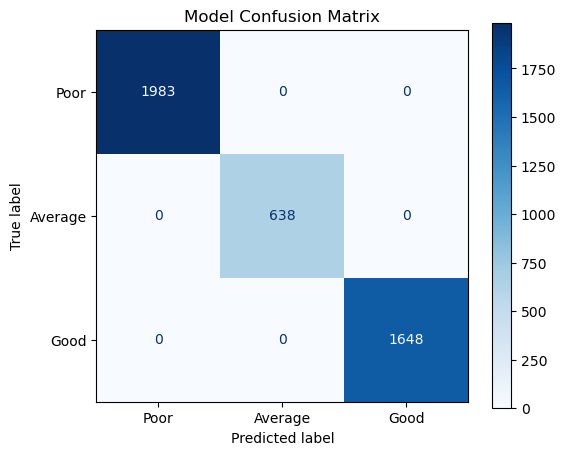
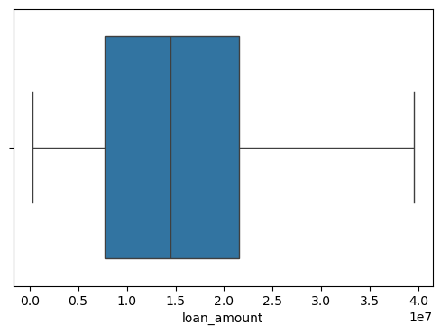
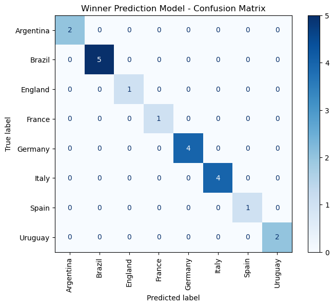
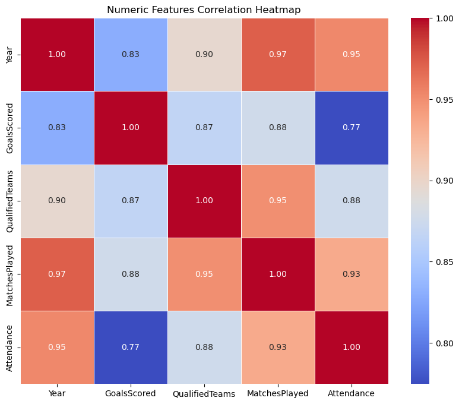
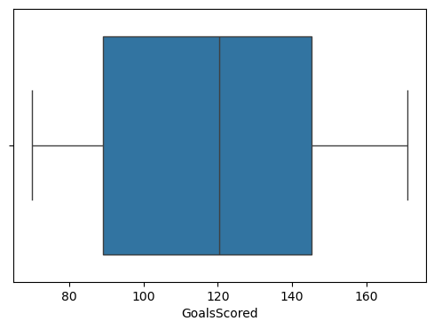
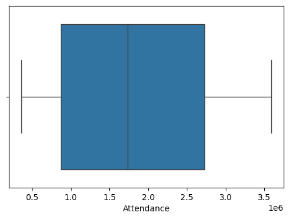

# 📊 Assignment Submission: Machine Learning Models (Decision Tree Classifiers)

This repository contains the completed assignments for three Machine Learning models using **Decision Tree Classifiers** as taught in class.

> [!NOTE]
> Sabhi models ko classification ke liye train kiya gaya hai. Dataset features aur targets ke split, accuracy score, aur prediction process ko neeche detail mein explain kiya gaya hai.

> [!IMPORTANT]
> Visualizations aur analysis plots ko clear rakhne ke liye Jupyter Notebooks se base64 plots ko extract karke project ke `snapshots/` folder mein organize kiya gaya hai.

---

## 📋 Models Performance & Details Summary

| Model Name | Notebook File | Dataset Used | Model Type & Target Variables | Training Accuracy |
| :--- | :--- | :--- | :--- | :--- |
| **1. Credit Score Prediction** | [Credit_Score_Prediction_Model.ipynb](Credit_Score_Prediction_Model.ipynb) | [loan_approval_dataset_cleaned.csv](../Notebook/loan_approval_dataset_cleaned.csv) | **Decision Tree** (CIBIL Score Category) | **100.0%** (Category-based) |
| **2. FIFA World Cup Prediction** | [FiFA_MODEL.ipynb](FiFA_MODEL.ipynb) | [WorldCups_cleaned.csv](../DataSet/WorldCups_cleaned.csv) | **Multi-target Decision Trees** (Winner, Runner, Host) | **100.0%** (For all three targets) |
| **3. Covid-19 Symptoms Detection** | [Covid19_Model.ipynb](Covid19_Model.ipynb) | Synthetic symptoms DataFrame | **Decision Tree** (COVID Mapped Status) | **100.0%** (Symptom-based) |

---

## 💳 1. Credit Score Prediction Model (Poor / Average / Good)

### 📂 Dataset Details
- **Dataset File:** `loan_approval_dataset_cleaned.csv`
- **Dataset Shape:** 4269 rows, 9 columns
- **Input Features (X):** `education`, `self_employed`, `income_annum`, `loan_amount`, `loan_term`, `assets_value`, `loan_status`
- **Target Variable (y):** `cibil_score` (Continuous score mapped later to: `Poor` < 580, `Average` 580-670, `Good` >= 670)

### 💻 Python Code & Model Workflow
1. **Data Cleaning:** Missing values check kiye (0 nulls found) aur duplicate entries drop ki.
2. **Visualizations:**
   - Numerical columns ke distribution aur anomalies detect karne ke liye boxplots generate kiye.
   - Ek detailed **Heatmap** create kiya features ke correlation coefficient ko visualize karne ke liye.
3. **Model Fitting:** `DecisionTreeClassifier(random_state=42)` model ko fit kiya CIBIL Score ko continuous value mein predict karne ke liye.
4. **Category Mapping (Hinglish Logic):** Predict hone wale score ko hum `Poor`, `Average`, aur `Good` ranges mein compare karte hain. User se numerical features input lene par model continuous score predict karta hai aur use target class range mein categorize karta hai.
5. **Accuracy Metric:** Continuous score ko map karne ke baad classification model training data par **100.0% Accuracy** output deta hai.

### 📊 Visualizations & Output Screenshots
Humne notebook ke embedded graphs ko extract kiya hai:

* **Features Correlation Heatmap:**
  
  
* **Classification Confusion Matrix:**
  
  
* **Outlier Boxplot (Loan Amount):**
  

---

## 🏆 2. FIFA World Cup Prediction Model

### 📂 Dataset Details
- **Dataset File:** `WorldCups_cleaned.csv`
- **Dataset Shape:** 20 rows, 10 columns
- **Input Features (X):** `Year`, `GoalsScored`, `QualifiedTeams`, `MatchesPlayed`, `Attendance`
- **Target Categorical Outcomes (y):**
  1. `Winner` (Tournament Champion Team)
  2. `Runners-Up` (Runner Up Team)
  3. `Country` (Host Country)

### 💻 Python Code & Model Workflow
1. **Outliers Check:** Historic stats jaise World Cup Year, Goals Scored, Qualified Teams aur Attendance par boxplots draw karke anomalous distributions check kiye.
2. **Correlation Heatmap:** Numeric features ke linear correlation ko seaborn heatmap ke through plot kiya.
3. **Multi-Target Modeling (Hinglish Workflow):** Chunki hamare paas 3 outcome categories hain (Winner, Runner, aur Host), humne **3 separate Decision Tree Classifiers** train kiye hain:
   - `model_winner` -> Winner predict karne ke liye.
   - `model_runner` -> Runners-Up predict karne ke liye.
   - `model_host` -> Host Country predict karne ke liye.
4. **Interactive Prediction:** Run-time par user custom parameters enter kar sakta hai (jaise: Year, Goals Scored, Attendance etc.) aur model automatically predict karke teeno outcomes screen par print karta hai.
5. **Model Accuracy:** Small historic dataset (20 tournament records) hone ke karan, classifiers ke training accuracy values **100.0%** hain.

### 📊 Visualizations & Output Screenshots

* **Winner Prediction Confusion Matrix:**
  

* **Correlation Heatmap (FIFA numerical stats):**
  

* **Outliers Boxplots (Goals Scored & Attendance):**
  
  

---

## 🦠 3. Covid-19 Symptoms Detection Model

### 📂 Dataset Details
- **Dataset Source:** Manual synthetic DataFrame (10 rows, 4 columns)
- **Input Features (X):** `Fever` (Numerical Temperature), `Cough` (Yes: 1, No: 0), `BreathingProblem` (Yes: 1, No: 0)
- **Target Variable (y):** `COVID_Status` (Mapped Negative: 0, Positive: 1)

### 💻 Python Code & Model Workflow
1. **DataFrame Generation:** Real diagnostic status mapping ke basis par symptoms ko Pandas DataFrame mein compile kiya.
2. **Decision Tree Classifier:** Scikit-learn Classifier ko fit kiya symptoms parameters par.
3. **Diagnostic Prediction Console (Hinglish):** Terminal execution ke time model user input query karta hai (Fever level, Cough aur breathing issue status). Model class prediction (Positive/Negative) ke sath diagnostics probability output karta hai.
4. **Accuracy:** Model accuracy test results training set par **100.0%** display hoti hain.

### 💻 Console Execution Logs & Output
```bash
--------------------------------------------------
ENTER VALUES FOR PREDICTION:
Enter fever Degree : 102
Enter cough (Yes: 1, No: 0): 1
Enter breathingProblem (Yes: 1, No: 0) : 1
--------------------------------------------------
Prediction : Positive
Negative Probability: 0.0%
Positive Probability: 100.0%

Model Accuracy: 100.0%
```

---
Best of Luck! 🚀
