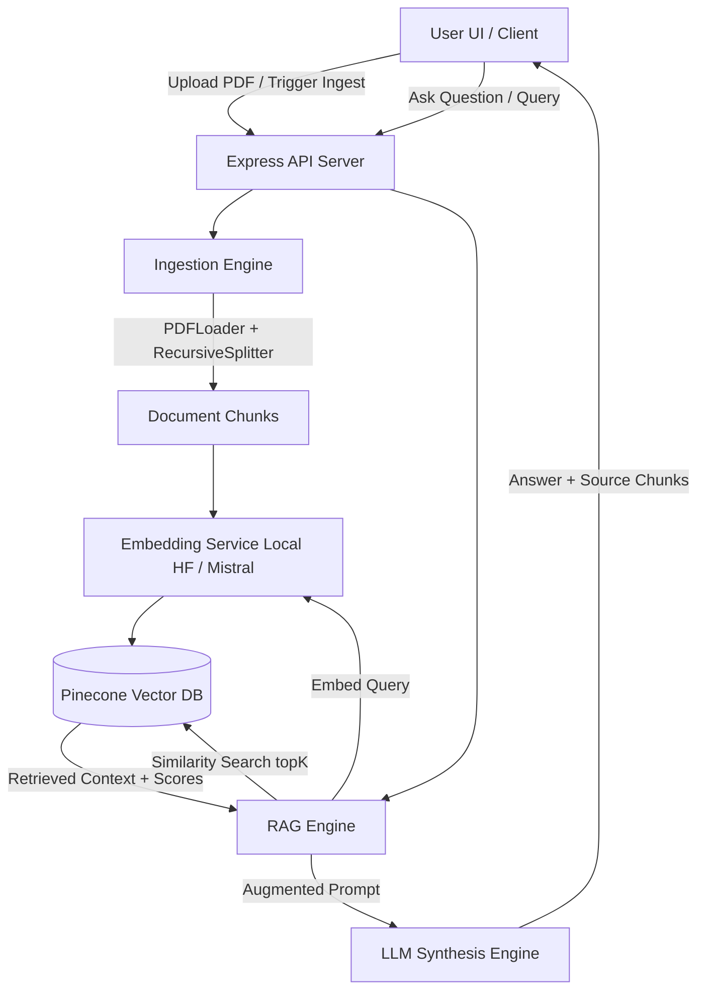

# Implementation Plan - Production-Ready RAG Application

Transform the current PDF processing and Pinecone code (`index.ts`, `classCode.ts`, `testing.ts`) into a robust, end-to-end **RAG (Retrieval-Augmented Generation)** application with an Express REST API backend and an interactive web interface.

## User Review Required

> [!IMPORTANT]
> **API Keys & Credentials**:
> Your `.env` currently contains a `PINECONE_API_KEY`.
> For text embeddings & answer generation, you can use:
> 1. **Local HuggingFace Embeddings** (`Xenova/all-MiniLM-L6-v2`) - *No API Key required for embeddings!* (As seen in `testing.ts`)
> 2. **Mistral AI** (`MISTRAL_API_KEY`) - (As seen in `classCode.ts`)
> 3. **OpenAI / Groq / HuggingFace API** - Optional extensions.
> 
> You can add your `MISTRAL_API_KEY` or other keys to `.env` anytime. The app will automatically fall back to local HuggingFace embeddings & intelligent context synthesis if no external LLM key is provided.

> [!NOTE]
> **Pinecone Index Configuration**:
> Make sure your Pinecone Index exists with the correct vector dimensions:
> - For **Local MiniLM-L6-v2**: Dimension is `384` (Index name default: `01-pdf-reader-rag` or `cohort-2-rag`).
> - For **Mistral Embeddings (`mistral-embed`)**: Dimension is `1024`.

---

## Proposed Architecture



---

## Proposed Changes

### Backend Architecture (`server/src/`)

#### [NEW] [env.ts](file:///c:/Users/Aditya/Desktop/CPUR-Agentic-AI/My_Learning/RAG/01_PDF-Reader/server/src/config/env.ts)
- Centralized environment loader for `PINECONE_API_KEY`, `PINECONE_INDEX_NAME`, `MISTRAL_API_KEY`, `EMBEDDING_PROVIDER` (`local` | `mistral`), and `PORT`.

#### [NEW] [embeddings.ts](file:///c:/Users/Aditya/Desktop/CPUR-Agentic-AI/My_Learning/RAG/01_PDF-Reader/server/src/services/embeddings.ts)
- Unified embedding interface providing:
  - `LocalHuggingFaceEmbeddings` using `@huggingface/transformers` (`Xenova/all-MiniLM-L6-v2`, 384 dims) as used in `testing.ts`.
  - `MistralAIEmbeddings` using `@langchain/mistralai` as used in `classCode.ts`.
  - Seamless fallback mechanism if Mistral key is absent.

#### [NEW] [vectorStore.ts](file:///c:/Users/Aditya/Desktop/CPUR-Agentic-AI/My_Learning/RAG/01_PDF-Reader/server/src/services/vectorStore.ts)
- Pinecone index manager and similarity query service.
- Batch upserting logic (with chunk metadata, batch sizes, and progress tracking).
- Vector similarity search returning content, metadata (page number, chunk ID), and relevance score.

#### [NEW] [ingestion.ts](file:///c:/Users/Aditya/Desktop/CPUR-Agentic-AI/My_Learning/RAG/01_PDF-Reader/server/src/services/ingestion.ts)
- Extends PDF loading from `index.ts` and `testing.ts`.
- Supports both static file loading (`pdf/SD.pdf`) and dynamic file uploads.
- Configurable chunk size and chunk overlap via `RecursiveCharacterTextSplitter`.

#### [NEW] [llm.ts](file:///c:/Users/Aditya/Desktop/CPUR-Agentic-AI/My_Learning/RAG/01_PDF-Reader/server/src/services/llm.ts)
- Context-augmented answer generation.
- Supports `@langchain/mistralai` or fallback smart context synthesizer if API key is not present.
- Prompts engineered for strict grounding (answering based on retrieved PDF context).

#### [NEW] [ragController.ts](file:///c:/Users/Aditya/Desktop/CPUR-Agentic-AI/My_Learning/RAG/01_PDF-Reader/server/src/controllers/ragController.ts)
- Express controller handling:
  - `POST /api/ingest`: Loads PDF, splits into chunks, embeds, and stores in Pinecone.
  - `POST /api/query`: Performs RAG workflow (retrieval + LLM answer synthesis).
  - `GET /api/status`: Checks connection status for Pinecone, index stats, and loaded documents.
  - `POST /api/upload`: Handles dynamic PDF file uploads using multipart/form-data.

#### [NEW] [routes.ts](file:///c:/Users/Aditya/Desktop/CPUR-Agentic-AI/My_Learning/RAG/01_PDF-Reader/server/src/routes/api.ts)
- Clean API route declarations.

#### [MODIFY] [index.ts](file:///c:/Users/Aditya/Desktop/CPUR-Agentic-AI/My_Learning/RAG/01_PDF-Reader/server/src/index.ts)
- Update entry point to launch Express server, static file hosting for frontend, and display active RAG endpoints.

---

### Frontend UI (`server/public/`)

#### [NEW] [index.html](file:///c:/Users/Aditya/Desktop/CPUR-Agentic-AI/My_Learning/RAG/01_PDF-Reader/server/public/index.html)
- Modern, responsive dark-themed RAG interface featuring:
  - System status panel (Pinecone Index status, Embedding model, Document count).
  - Document ingestion control (one-click ingest of `SD.pdf` or custom PDF upload).
  - Conversational Q&A chat interface.
  - Source Context Drawer / Inspector (displaying exact matching text chunks, page numbers, and similarity scores).

#### [NEW] [app.css](file:///c:/Users/Aditya/Desktop/CPUR-Agentic-AI/My_Learning/RAG/01_PDF-Reader/server/public/app.css)
- Sleek modern styling with glassmorphism, glowing badges, and smooth animation transitions.

#### [NEW] [app.js](file:///c:/Users/Aditya/Desktop/CPUR-Agentic-AI/My_Learning/RAG/01_PDF-Reader/server/public/app.js)
- Asynchronous API communication, chat UI updates, streaming-style typing effect, expandable source chunk inspector.

---

## Verification Plan

### Automated Tests / Code Checks
- Run TypeScript type check:
  ```powershell
  npx tsc --noEmit
  ```
- Test server startup and build scripts.

### Manual Verification
1. Launch dev server: `npm run dev` inside `server/`.
2. Access `http://localhost:3000` in browser.
3. Ingest `SD.pdf` into Pinecone vector index and verify batch progress output.
4. Execute query "what is this document about?" or "how was the internship experience?" and verify accurate answer with retrieved context chunks & scores.
