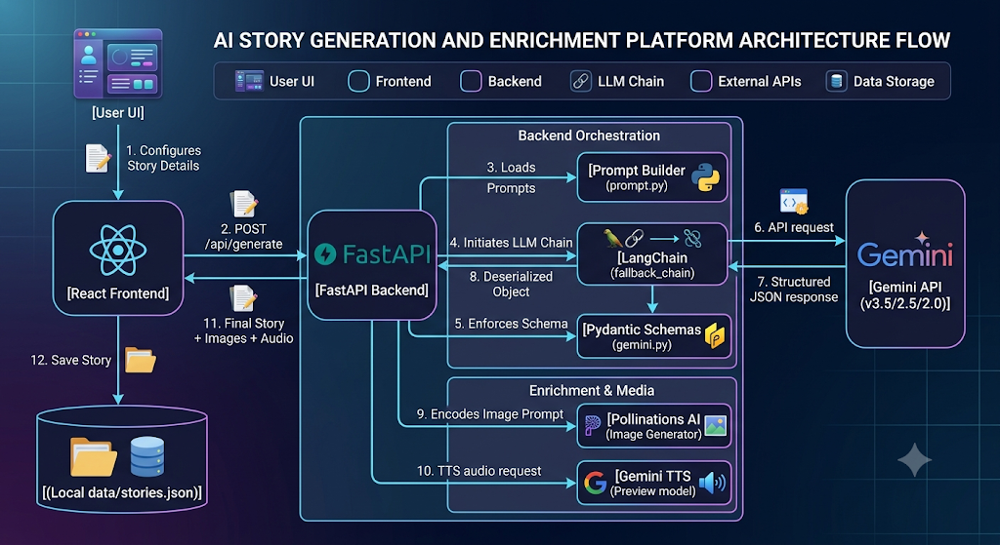

# StoryScape AI 📚✨

StoryScape AI is an interactive, AI-powered storytelling platform that generates premium, multi-chapter illustrated stories tailored to user-specified themes, genres, age groups, and writing styles. In addition to story generation, the application offers an AI creative editor for story suggestions and dynamic Text-To-Speech (TTS) narration using Gemini's latest multimodal audio capabilities.

---

## 🚀 Key Features

- **Dynamic Multi-Chapter Generation**: Automatically creates rich, cohesive stories with a set number of chapters (3, 5, or 8) based on length preferences.
- **Structural Guarantees**: Leverages Pydantic schemas to ensure story titles, character bios, and chapter text always arrive in the exact format required by the UI.
- **Atmospheric Illustrations**: Automatically generates visual illustration prompts for each chapter, dynamically fetching high-quality custom artwork using Pollinations AI.
- **AI Creative consultant**: Analyzes stories to suggest plot twists, character growth suggestions, and alternative endings.
- **Dramatic TTS Narration**: Uses Gemini's native text-to-speech engine to narrate stories in selected storytelling voices.
- **Persistent Library Shelf**: Save, load, and delete generated stories from a local filesystem database.

---

## 🛠️ Technology Stack

StoryScape AI is built using a modern full-stack architecture:

### Frontend

- **Core Framework**: React 19 (TypeScript) with Vite as the build tool.
- **Styling**: Tailwind CSS v4 for a sleek, responsive dark-mode interface.
- **Animations**: Motion (framer-motion) for smooth, premium transitions, modal views, page flips, and micro-interactions.
- **Icons**: Lucide React.

### Backend

- **API Framework**: FastAPI & Uvicorn.
- **AI Orchestration**: LangChain (`langchain` and `langchain-google-genai`) for text generation and structured outputs.
- **Direct SDK Integration**: Official Google GenAI Python SDK (`google-genai`) for handling Gemini's native multimodal TTS audio generation.
- **Configuration**: Python-dotenv.

---

## 🔄 Project Flow & Architecture



### Detailed Component Flows

1. **Story Generation (`/api/generate`)**:
   - The user selects a topic, genre, length, target age group, and writing style.
   - The backend passes these variables to the `Prompt Builder`.
   - The `LangChain Fallback Chain` calls the Gemini API with structured constraints.
   - The generated response is parsed, enriched with image generation URLs for each chapter, and returned to the UI.
2. **Story Suggestions (`/api/suggest`)**:
   - The frontend sends the current story details (title, summary, chapters) to the backend.
   - Gemini processes this structure and returns creative edits (plot twists, character arcs, and alternative endings) mapping to a schema.
3. **TTS Narration (`/api/tts`)**:
   - The user clicks the narration icon on a chapter.
   - The backend invokes `gemini-3.1-flash-tts-preview` with the chapter text.
   - The native audio bytes are base64-encoded and returned to the frontend, which plays them in the custom audio component.

---

## 📂 Project Directory Structure

```
StoryScape AI/
├── .env.example            # Environment variables template
├── package.json            # Workspace setup
├── backend/
│   ├── .env                # Configured environment variables (GEMINI_API_KEY)
│   ├── app.py              # FastAPI application server & route middleware
│   ├── gemini.py           # LangChain orchestration, fallbacks, Pydantic schemas, and TTS
│   ├── prompt.py           # System instructions and prompt templates
│   ├── requirements.txt    # Python package dependencies
│   └── data/
│       └── stories.json    # Local JSON database for saved stories
└── frontend/
    ├── index.html          # SPA entryway
    ├── package.json        # Node.js dependencies
    ├── vite.config.ts      # Vite configuration
    └── src/
        ├── App.tsx         # Main interactive UI component
        ├── main.tsx        # React mounting entrypoint
        └── index.css       # Tailwind directives and custom animation styles
```

---

## 🧠 Core Backend Components & Design Decisions

### 1. Why Schemas are Created (`gemini.py`)

To prevent the application from crashing due to unexpected LLM syntax errors or missing data keys, we define four crucial **Pydantic Schemas** to enforce structural guarantees:

- **`CharacterSchema`**: Defines the fields `name`, `description`, and `personality`. Enforces that the model always generates complete profiles for all key figures.
- **`ChapterSchema`**: Defines `chapterNumber`, `title`, `text` (substantial narrative prose), and `imagePrompt` (cinematic instructions for artwork).
- **`StorySchema`**: Groups `title`, `summary`, `characters` (list of `CharacterSchema`), and `chapters` (list of `ChapterSchema`).
- **`SuggestionSchema`**: Defines `plotTwists`, `alternateEndings`, and `characterImprovements` lists.

By supplying these schemas to LangChain's `.with_structured_output()`, the model is forced to output valid JSON conforming exactly to the Pydantic type definitions. LangChain then automatically deserializes the response directly into clean Python objects, making it incredibly robust compared to manual regex or JSON parser hacks.

### 2. What the Prompts do (`prompt.py`)

Prompt engineering in StoryScape AI is split into two specialized generators:

- **`build_generation_prompts(...)`**:
  - **System Instruction**: Establishes the AI's persona as an _"award-winning master novelist, creative director, and interactive storyteller"_. It enforces strict compliance with age-appropriateness, word counts (150-300 words per chapter), exact chapter count (calculated based on length), and visual description styles. It also explicitly forbids using terms like "generate" or "image" inside the generated image prompts to prevent low-quality inputs.
  - **User Prompt**: Directs the LLM to write a spectacular narrative on the specified topic.
- **`build_suggestion_prompts(...)`**:
  - **System Instruction**: Positions the AI as a _"professional creative editor and script consultant"_. Instructs it to analyze the narrative flow, character behaviors, and outline exactly 3 logical plot twists, 2 endings, and 3 character arcs to deepen the story.
  - **User Prompt**: Feeds a simplified version of the story (titles and text) to the editor model to save token context.

### 3. LangChain Fallback & Retry Strategy

APIs are prone to transient failures, rate limits, or context constraints. To make StoryScape AI production-ready, we implemented a robust **Fallback Chain** in `gemini.py`:

```python
models_to_try = [
    model_name,            # Primary model: gemini-3.5-flash
    "gemini-3.5-flash",    # Backup 1
    "gemini-2.5-flash",    # Backup 2
    "gemini-2.0-flash",    # Backup 3
    "gemini-flash-latest", # Backup 4
    "gemini-2.5-pro",      # Backup 5
]
```

Using LangChain's `.with_fallbacks()` method, we bundle these configurations together. If the primary model encounters any API or rate-limiting exception, LangChain automatically catches the error and instantly redirects the request to the next backup model in the pipeline, ensuring a completely uninterrupted user experience.

---

## 🛠️ Installation & Setup

### Prerequisites

- Python 3.10+
- Node.js 18+
- Gemini API Key (obtained from [Google AI Studio](https://aistudio.google.com/))

### 1. Environment Configuration

Create a `.env` file inside the `backend` folder:

```env
GEMINI_API_KEY=your_gemini_api_key_here
```

### 2. Backend Installation

```bash
cd backend
python -m venv venv
# Activate the virtual environment:
# Windows:
venv\Scripts\activate
# macOS/Linux:
source venv/bin/activate

pip install -r requirements.txt
```

### 3. Frontend Installation

```bash
cd ../frontend
npm install
```

### 4. Running the Application

To run both the FastAPI backend and Vite frontend concurrently in development mode:

```bash
# In the frontend directory, run:
npm run dev
```

_(Or run the backend and frontend separately in two terminals using `python app.py` inside `backend` and `npm run dev` inside `frontend`)_.
