# 🎓 CPUR-Agentic-AI — Academic & Internship Portfolio

> **A comprehensive repository documenting my journey through **Agentic AI Internship** at Career Point University, alongside **MCA academic coursework** spanning Data Structures & Algorithms, Web Development, Java, R Programming, and Machine Learning.**


---

## 📑 Table of Contents

- [📖 Overview](#-overview)
- [🗂️ Repository Structure](#-repository-structure)
- [🤖 Agentic AI Internship Training](#-agentic-ai-internship-training)
  - [Phase 01 — Python Foundations](#phase-01--python-foundations)
  - [Phase 02 — Data Science & Machine Learning](#phase-02--data-science--machine-learning)
  - [Phase 03 — Generative AI & Deep Learning](#phase-03--generative-ai--deep-learning)
  - [Phase 04 — Agentic AI & LangChain](#phase-04--agentic-ai--langchain)
- [📊 Kaggle Datasets & ML Models](#-kaggle-datasets--ml-models)
- [📚 Academic Coursework — Semester 01](#-academic-coursework--semester-01)
- [📚 Academic Coursework — Semester 02](#-academic-coursework--semester-02)
- [🚀 Key Projects](#-key-projects)
- [🛠️ Technologies & Tools](#-technologies--tools)
- [📈 Learning Outcomes](#-learning-outcomes)
- [🚦 Getting Started](#-getting-started)
- [📄 License](#-license)

---

## 📖 Overview

This repository serves as a **centralized portfolio** for my work during the **MCA program at Career Point University (Kota)**. It encompasses two major pillars:

1. **In-House Internship on Agentic AI** — A structured 22-day training program covering Python fundamentals → Data Science → Machine Learning → Deep Learning → Generative AI → Agentic AI with LangChain & RAG.
2. **MCA Academic Coursework** — Semester 1 (DSA, Web Technologies, Python) and Semester 2 (Java, R Programming, Open Source).

The repository is designed to showcase **progressive skill development** from foundational programming to cutting-edge Agentic AI concepts, with real-world datasets, hands-on projects, and comprehensive documentation.

---

## 🗂️ Repository Structure

```
CPUR-Agentic-AI/
├── 📁 CPUR-AGENTIC-AI-TRAINING/          # Internship training (22 days)
│   ├── 📁 01_Phase/                      # Python Foundations (Days 1-5)
│   ├── 📁 02_Phase/                      # Data Science & ML (Days 6-14)
│   ├── 📁 03_Phase/                      # GenAI & Deep Learning (Days 15-18)
│   ├── 📁 04_phase/                      # Agentic AI & LangChain (Days 20-22)
│   ├── 📁 kaggle-Dataset-Uploaded/        # 10 ML datasets & notebooks
│   ├── 📁 My_Learning/                   # Personal RAG experiments
│   └── 📁 Projects/                      # StoryScape AI — Full-stack project
│
├── 📁 SEMESTERs/                          # Academic coursework
│   ├── 📁 01_sem/                        # DSA, PHP, Python, Web Tech
│   └── 📁 02_sem/                        # Java, R Programming, Open Source
│
└── 📄 Readme.md                          # This file (you are here)
```

---

## 🤖 Agentic AI Internship Training

A **22-day in-house internship** at Career Point University under the guidance of **Asif Sir**, covering the complete AI/ML pipeline from basics to Agentic AI.

### Phase 01 — Python Foundations
*Days 1–5: Building strong programming fundamentals*

| Day | Topic | Highlights |
|:---:|-------|------------|
| **01** | Python Intro, Variables & Data Types | `print()`, escape sequences, `dir()`, `help()`, dynamic typing |
| **02** | Operators & Fundamentals | Arithmetic, Logical, Bitwise, Membership, Identity operators |
| **03** | Loops & Pattern Programming | `while`/`for` loops, `break`/`continue`, pattern printing, **Cricket Score Analyzer** task |
| **04** | Data Structures | List, Tuple, Set, FrozenSet, Dict — methods, slicing, shallow vs deep copy |
| **05** | Functions, Lambda, Recursion & File Handling | `*args`/`**kwargs`, lambda, generators (`yield`), **Scientific Calculator** project |

### Phase 02 — Data Science & Machine Learning
*Days 6–14: From data to predictive models*

| Day | Topic | Highlights |
|:---:|-------|------------|
| **06** | Data Science Lifecycle & NumPy | 9-step DS lifecycle, array creation, broadcasting, slicing |
| **07** | Pandas — Series & DataFrame | `loc[]`/`iloc[]`, filtering, sorting, real-world CSV loading |
| **08** | Pandas Loading & Matplotlib | Multi-format data loading (CSV, Excel, JSON, SQL), line/bar charts |
| **09** | Matplotlib & Data Cleaning | Pie, donut, histogram, scatter plots; missing value imputation, outlier detection |
| **10** | EDA & Data Cleaning | 15-step EDA workflow on Titanic, Student Performance, Mall Customers, Netflix |
| **11** | ML Introduction & IPL EDA | AI vs ML vs DL, IPL match analysis (2008–2024) |
| **12** | Regression in ML | Linear, Multiple, Polynomial Regression; House Price & Student Marks prediction |
| **13** | Classification in ML | Logistic Regression, Decision Trees; Loan Approval & Iris classification |
| **14** | Model Evaluation | Confusion Matrix, Precision, Recall, F1-Score, Train-Test Split |

### Phase 03 — Generative AI & Deep Learning
*Days 15–18: Entering the world of neural networks & LLMs*

| Day | Topic | Highlights |
|:---:|-------|------------|
| **15** | Generative AI & LLMs | Tokens, parameters, prompt engineering, transformers, attention mechanism |
| **16** | APIs & Gen AI Integration | REST APIs, Gemini API, **AI Email Generator**, **StoryScape AI** project |
| **17** | Deep Learning & ANNs | Keras Sequential API, activation functions, Student Pass/Fail prediction |
| **18** | DL Training Process & MNIST | Forward/backward propagation, MNIST digit recognition, model saving/loading |

### Phase 04 — Agentic AI & LangChain
*Days 20–22: Building autonomous AI agents*

| Day | Topic | Highlights |
|:---:|-------|------------|
| **20** | Agentic AI & LLM Foundations | ReAct agent loop, tokenization, embeddings, cosine similarity, temperature scaling |
| **21** | LangChain & Chat Models | Prompt templates, chains, memory, RAG, **AI Chat Assistant** with memory |
| **22** | Gemini SDK, Embeddings, Vector DBs | ChromaDB/FAISS, semantic search, document loaders, RAG pipeline |

---

## 📊 Kaggle Datasets & ML Models

A collection of **10 real-world datasets** with end-to-end machine learning notebooks:

| # | Dataset | Model/Task | Notebook |
|:-:|---------|------------|----------|
| 01 | 🦠 **COVID-19** | Exploratory Data Analysis & Prediction | [View](./CPUR-AGENTIC-AI-TRAINING/kaggle-Dataset-Uploaded/01_COVID-19/Covid19_Model.ipynb) |
| 02 | 🏠 **House Price Prediction** | Multiple Linear Regression | [View](./CPUR-AGENTIC-AI-TRAINING/kaggle-Dataset-Uploaded/02_House_Price_Prediction/02_House_model.ipynb) |
| 03 | 🏏 **IPL Match Analysis** | EDA & Visualization (2008-2024) | [View](./CPUR-AGENTIC-AI-TRAINING/kaggle-Dataset-Uploaded/03_IPL_Analysis/IPL_Capstone_Project.ipynb) |
| 04 | 📚 **Student Marks** | Regression Analysis | [View](./CPUR-AGENTIC-AI-TRAINING/kaggle-Dataset-Uploaded/04_Student_Marks_Analysis/03_Student_Marks.ipynb) |
| 05 | 🌸 **Iris Flower** | Decision Tree Classification | [View](./CPUR-AGENTIC-AI-TRAINING/kaggle-Dataset-Uploaded/05_Iris_Classification/Iris_.ipynb) |
| 06 | ⚽ **FIFA Player Performance** | Prediction Model | [View](./CPUR-AGENTIC-AI-TRAINING/kaggle-Dataset-Uploaded/06_FIFA_Player_Prediction/FIFA_Player_Prediction.ipynb) |
| 07 | 💳 **Loan Approval** | Logistic Regression & Decision Tree | [View](./CPUR-AGENTIC-AI-TRAINING/kaggle-Dataset-Uploaded/07_Loan_Approval_Prediction/Loan_Approval_DataSet.ipynb) |
| 08 | 🎬 **Netflix Titles** | EDA & Recommendation Analysis | [View](./CPUR-AGENTIC-AI-TRAINING/kaggle-Dataset-Uploaded/08_Netflix_Recommendation_Analysis/netflix_data.ipynb) |
| 09 | 🛍️ **Mall Customer Segmentation** | Clustering Analysis | [View](./CPUR-AGENTIC-AI-TRAINING/kaggle-Dataset-Uploaded/09_Mall_Customer_Segmentation/mall_data.ipynb) |
| 10 | 🚢 **Titanic Survival** | Classification & EDA | [View](./CPUR-AGENTIC-AI-TRAINING/kaggle-Dataset-Uploaded/10_Titanic_Survival_Prediction/10_Analysis.ipynb) |

---

## 📚 Academic Coursework — Semester 01

**Foundations & DSA** — Building core programming skills across multiple languages.

| Subject | Topics | Technologies |
|---------|--------|-------------|
| **Data Structures & Algorithms** | Sorting, Searching, Recursion, Pattern Programming | C++, Java, JavaScript |
| **Web Technology** | HTML, CSS, JavaScript basics | HTML5, CSS3 |
| **Python Programming** | Computational thinking, logic building | Python |
| **PHP Learning** | Server-side scripting, database connectivity | PHP, MySQL |
| **Major Projects** | Instagram UI clone, YouTube interface clone | HTML, CSS, JavaScript |

📂 **Directory:** [SEMESTERs/01_sem](./SEMESTERs/01_sem/)

---

## 📚 Academic Coursework — Semester 02

**Java & Data Analysis** — Deep dive into Java with R for statistical computing.

| Subject | Topics | Highlights |
|---------|--------|------------|
| **Java Programming** | 40-question roadmap: Basics → Conditionals → Loops → Arrays → Recursion → LeetCode-style | [Full Question Bank](./SEMESTERs/02_sem/JAVA/Questions.md) |
| **R Programming** | Statistical computing, data visualization, Shiny dashboards | Air Quality Dashboard, dplyr, ggplot2 |
| **Open Source** | Linux administration, shell scripting, automation | Bash scripts, cron jobs, system administration |

📂 **Directory:** [SEMESTERs/02_sem](./SEMESTERs/02_sem/)

---

## 🚀 Key Projects

### 🎭 StoryScape AI — AI Story Generator
A full-stack web application that generates creative stories using the Gemini API, built with FastAPI backend and modern frontend.
- **Stack:** Python, FastAPI, Gemini API, HTML/CSS/JS
- **Location:** [CPUR-AGENTIC-AI-TRAINING/Projects/StoryScape AI](./CPUR-AGENTIC-AI-TRAINING/Projects/StoryScape%20AI/)

### 💬 AI Chat Assistant
A conversational AI assistant with memory using LangChain and Gemini API.
- **Stack:** Python, LangChain, Gemini API
- **Location:** [CPUR-AGENTIC-AI-TRAINING/04_phase/21_Day_4-07-2026/project/](./CPUR-AGENTIC-AI-TRAINING/04_phase/21_Day_4-07-2026/project/)

### 🧮 Scientific Calculator
A web-based scientific calculator built as a Day 05 project.
- **Stack:** HTML, CSS, JavaScript
- **Location:** [CPUR-AGENTIC-AI-TRAINING/01_Phase/05_Day_15-06-2026/Scientific_Calculator/](./CPUR-AGENTIC-AI-TRAINING/01_Phase/05_Day_15-06-2026/Scientific_Calculator/)

### 📧 AI Email Generator
API-based email generation tool using FastAPI and Gemini.
- **Stack:** Python, FastAPI, Gemini API
- **Location:** [CPUR-AGENTIC-AI-TRAINING/03_Phase/16_Day_29-06-2026/](./CPUR-AGENTIC-AI-TRAINING/03_Phase/16_Day_29-06-2026/)

---

## 🛠️ Technologies & Tools

### Programming Languages


### ML/DL & Data Science


### AI & Agentic Frameworks


### Web & Backend


### Tools & Platforms


---

## 📈 Learning Outcomes

This repository represents a **structured learning journey** from absolute beginner to building Agentic AI systems:

```mermaid
flowchart LR
    A[Python Basics] --> B[Data Science & NumPy/Pandas]
    B --> C[Machine Learning Models]
    C --> D[Deep Learning & Neural Networks]
    D --> E[Generative AI & LLMs]
    E --> F[Agentic AI & LangChain]
    F --> G[RAG & Vector Databases]
    
    style A fill:#4CAF50,color:white
    style B fill:#2196F3,color:white
    style C fill:#FF9800,color:white
    style D fill:#9C27B0,color:white
    style E fill:#E91E63,color:white
    style F fill:#f44336,color:white
    style G fill:#00BCD4,color:white
```



**Key competencies developed:**
- ✅ **Python Programming** — From variables to advanced concepts (OOP, generators, decorators)
- ✅ **Data Science Pipeline** — Complete 9-step lifecycle with real-world datasets
- ✅ **Machine Learning** — Supervised learning (Regression, Classification) with scikit-learn
- ✅ **Deep Learning** — Neural networks with TensorFlow/Keras, MNIST digit recognition
- ✅ **Generative AI** — LLM fundamentals, prompt engineering, API integration
- ✅ **Agentic AI** — LangChain, ReAct agents, memory, tool integration
- ✅ **RAG Systems** — Embeddings, vector databases (ChromaDB/FAISS), semantic search
- ✅ **Java & R** — Academic coursework with 40-question Java roadmap and R statistical computing
- ✅ **Web Development** — HTML/CSS/JS, PHP, FastAPI, Shiny dashboards

---

## 🚦 Getting Started

### Prerequisites
- Python 3.10+
- Jupyter Notebook / Google Colab
- Java JDK (for Semester 02 Java code)
- R & RStudio (for Semester 02 R code)

### Clone the Repository
```bash
git clone https://github.com/Adit122022/CPUR-Agentic-AI.git
cd CPUR-Agentic-AI
```

### Explore the Training
Each day's content is self-contained with its own `Readme.md`, notebooks, and code files:

```bash
# Start with Python basics
cd "CPUR-AGENTIC-AI-TRAINING/01_Phase/01_Day_10-06-2026"

# Or jump to ML models
cd "CPUR-AGENTIC-AI-TRAINING/kaggle-Dataset-Uploaded/01_COVID-19"
```

### Install Dependencies
For ML/DL notebooks:
```bash
pip install numpy pandas matplotlib seaborn scikit-learn tensorflow keras
```

For LangChain/Agentic AI:
```bash
pip install langchain google-generativeai chromadb faiss-cpu sentence-transformers
```

---

## 📄 License

This repository is maintained for **educational and portfolio purposes** as part of the MCA program at Career Point University, Kota.

---

<p align="center">
  <b>🚀 Built with dedication during the Agentic AI Internship & MCA Program at Career Point University</b><br>
  <i>— Aditya —</i>
</p>

<p align="center">
  <a href="https://github.com/Adit122022/CPUR-Agentic-AI">
    
  </a>
  <a href="https://github.com/Adit122022/CPUR-Agentic-AI">
    
  </a>
</p>